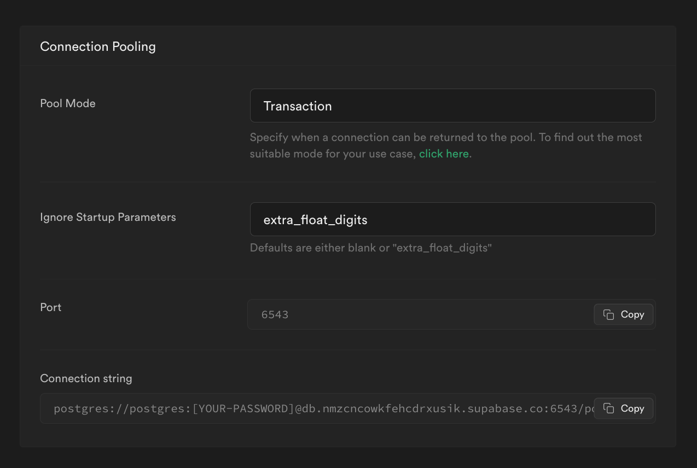

# Steps

1. Create new Supabase project and choose `sa-east-1` region (São Paulo).
2. Run `npx prisma migrate dev deploy`
3. Add your DB secrets according to the template file.
4. Run `yarn prisma` and check if result is also is similar.

# Results

## With pg-bouncer

```bash
➜  prisma-test yarn prisma
yarn run v1.22.19
$ npx ts-node index.ts
Inserting mocked data...
inserted mocked data: 9.112s
✨  Done in 11.11s.
```

## Without pg-bouncer

```bash
➜  prisma-test yarn prisma
yarn run v1.22.19
$ npx ts-node index.ts
Inserting mocked data...
inserted mocked data: 383.718ms
✨  Done in 2.45s.
```

# Supabase Setup

Postgres version: 15.1.0.88 (latest at time of writing)
Max connections: 60

## Connection pooling


